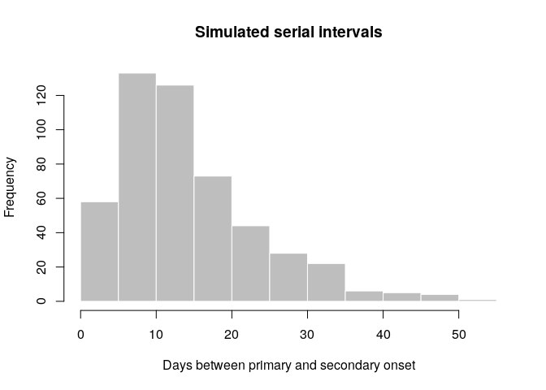
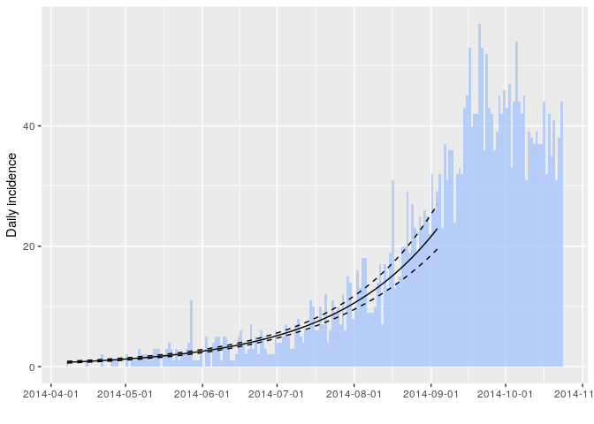
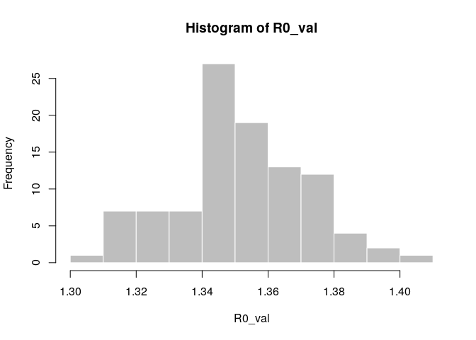
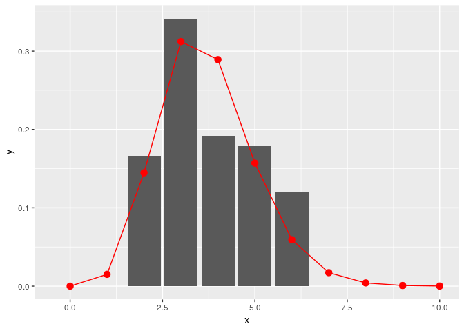

[](https://ci.appveyor.com/project/thibautjombart/epitrix/branch/master) [](https://travis-ci.org/reconhub/epitrix) [](https://codecov.io/github/reconhub/epitrix?branch=master) [](https://cran.r-project.org/package=epitrix) [](https://cran.r-project.org/package=epitrix) [](http://www.r-pkg.org/pkg/epitrix)

Welcome to the *epitrix* package!
=================================

This package implements small helper functions usefull in infectious disease modelling and epidemics analysis.

Installing the package
----------------------

To install the current stable, CRAN version of the package, type:

``` r
install.packages("epitrix")
```

To benefit from the latest features and bug fixes, install the development, *github* version of the package using:

``` r
devtools::install_github("reconhub/epitrix")
```

Note that this requires the package *devtools* installed.

What does it do?
================

The main features of the package include:

-   **`gamma_shapescale2mucv`**: convert shape and scale of a Gamma distribution to mean and CV

-   **`gamma_mucv2shapescale`**: convert mean and CV of a Gamma distribution to shape and scale

-   **`gamma_log_likelihood`**: Gamma log-likelihood using mean and CV

-   **`r2R0`**: convert growth rate into a reproduction number

-   **`lm2R0_sample`**: generates a distribution of R0 from a log-incidence linear model

-   **`fit_disc_gamma`**: fits a discretised Gamma distribution to data (typically useful for describing delays)

-   **`clean_labels`**: generate portable labels by removing non-standard characters or replacing them with their closest alphanumeric matches, standardising separators, etc.

-   **`hash_names`**: generate unique, anonymised, reproducible labels from various data fields (e.g. First name, Last name, Date of birth).

-   **`emperical_incubation_dist()`** will estimate the empirical incubation distribution if given a data frame with dates of onset and a range of exposure dates.

-   **`fit_gamma_incubation_dist()`** wraps `empirical_incubation_dist()` and `fit_disc_gamma()` to fit a discretized gamma distribution to an empirical incubation distribution

Resources
=========

Worked examples
---------------

### Fitting a gamma distribution to delay data

In this example, we simulate data which replicate the serial interval (SI), i.e. the delays between primary and secondary symptom onsets, in Ebola Virus Disease (EVD). We start by converting previously estimates of the mean and standard deviation of the SI (WHO Ebola Response Team (2014) NEJM 371:1481–1495) to the parameters of a Gamma distribution:

``` r
library(epitrix)

mu <- 15.3 # mean in days days
sigma <- 9.3 # standard deviation in days
cv <- sigma/mu # coefficient of variation
cv
```

    ## [1] 0.6078431

``` r
param <- gamma_mucv2shapescale(mu, cv) # convertion to Gamma parameters
param
```

    ## $shape
    ## [1] 2.706556
    ##
    ## $scale
    ## [1] 5.652941

The *shape* and *scale* are parameters of a Gamma distribution we can use to generate delays. However, delays are typically reported per days, which implies a discretisation (from continuous time to discrete numbers). We use the package [*distcrete*](https://github.com/reconhub/distcrete) to achieve this discretisation. It generates a list of functions, including one to simulate data (`$r`), which we use to simulate 500 delays:

``` r
si <- distcrete::distcrete("gamma", interval = 1,
               shape = param$shape,
               scale = param$scale, w = 0)
si
```

    ## A discrete distribution
    ##   name: gamma
    ##   parameters:
    ##     shape: 2.70655567117586
    ##     scale: 5.65294117647059

``` r
set.seed(1)
x <- si$r(500)
head(x, 10)
```

    ##  [1]  8 10 15 28  7 27 32 17 16  4

``` r
hist(x, col = "grey", border = "white",
     xlab = "Days between primary and secondary onset",
     main = "Simulated serial intervals")
```



`x` contains simulated data, for illustrative purpose. In practice, one would use real data from an ongoing outbreaks. Now we use `fit_disc_gamma` to estimate the parameters of a dicretised Gamma distribution from the data:

``` r
si_fit <- fit_disc_gamma(x)
si_fit
```

    ## $mu
    ## [1] 15.21914
    ##
    ## $cv
    ## [1] 0.5851581
    ##
    ## $sd
    ## [1] 8.905604
    ##
    ## $ll
    ## [1] -1741.393
    ##
    ## $converged
    ## [1] TRUE
    ##
    ## $distribution
    ## A discrete distribution
    ##   name: gamma
    ##   parameters:
    ##     shape: 2.92047557759351
    ##     scale: 5.21118646429829

### Converting a growth rate (r) to a reproduction number (R0)

The package [*incidence*](https://github.com/reconhub/incidence) can fit a log-linear model to incidence curves (function `fit`), which produces a growth rate (r). This growth rate can in turn be translated into a basic reproduction number (R0) using `r2R0`. We illustrate this using simulated Ebola data from the [*outbreaks*](https://github.com/reconhub/outbreaks) package, and using the serial interval from the previous example:

``` r
library(outbreaks)
library(incidence)

i <- incidence(ebola_sim$linelist$date_of_onset)
i
```

    ## <incidence object>
    ## [5888 cases from days 2014-04-07 to 2015-04-30]
    ##
    ## $counts: matrix with 389 rows and 1 columns
    ## $n: 5888 cases in total
    ## $dates: 389 dates marking the left-side of bins
    ## $interval: 1 day
    ## $timespan: 389 days
    ## $cumulative: FALSE

``` r
f <- fit(i[1:150]) # fit on first 150 days
```

    ## Warning in fit(i[1:150]): 22 dates with incidence of 0 ignored for fitting

``` r
plot(i[1:200], fit = f, color = "#9fc2fc")
```



``` r
r2R0(f$info$r, si$d(1:100))
```

    ## [1] 1.348624

``` r
r2R0(f$info$r.conf, si$d(1:100))
```

    ##         2.5 %   97.5 %
    ## [1,] 1.314055 1.383674

In addition, we can also use the function `lm2R0_sample` to generate samples of R0 values compatible with a model fit:

``` r
R0_val <- lm2R0_sample(f$model, si$d(1:100), n = 100)
head(R0_val)
```

    ## [1] 1.350970 1.347374 1.350076 1.358523 1.341549 1.341634

``` r
hist(R0_val, col = "grey", border = "white")
```



### Standardising labels

If you want to use labels that will work across different computers, independent of local encoding and operating systems, `clean_labels` will make your life easier. The function transforms character strings by replacing diacritic symbols with their closest alphanumeric matches, setting all characters to lower case, and replacing various separators with a single, consistent one.

For instance:

``` r
x <- " Thîs- is A   wêïrD LäBeL .."
x
```

    ## [1] " Thîs- is A   wêïrD LäBeL .."

``` r
clean_labels(x)
```

    ## [1] "this_is_a_weird_label"

``` r
variables <- c("Date.of.ONSET ",
               "/  date of hôspitalisation  /",
               "-DäTÈ--OF___DîSCHARGE-",
               "GEndèr/",
               "  Location. ")
variables
```

    ## [1] "Date.of.ONSET "                "/  date of hôspitalisation  /"
    ## [3] "-DäTÈ--OF___DîSCHARGE-"        "GEndèr/"
    ## [5] "  Location. "

``` r
clean_labels(variables)
```

    ## [1] "date_of_onset"           "date_of_hospitalisation"
    ## [3] "date_of_discharge"       "gender"
    ## [5] "location"

### Anonymising data

`hash_names` can be used to generate hashed labels from linelist data. Based on pre-defined fields, it will generate anonymous labels. This system has the following desirable features:

-   given the same input, the output will always be the same, so this encoding system generates labels which can be used by different people and organisations

-   given different inputs, the output will always be different; even minor differences in input will result in entirely different outputs

-   given an output, it is very hard to infer the input (it requires hacking skills); if security is challenged, the hashing algorithm can be 'salted' to strengthen security

``` r
first_name <- c("Jane", "Joe", "Raoul", "Raoul")
last_name <- c("Doe", "Smith", "Dupont", "Dupond")
age <- c(25, 69, 36, 36)

## detailed output by default
hash_names(first_name, last_name, age)
```

    ##             label hash_short
    ## 1     jane_doe_25     6485f2
    ## 2    joe_smith_69     ea1ccc
    ## 3 raoul_dupont_36     f60676
    ## 4 raoul_dupond_36     cd7104
    ##                                                               hash
    ## 1 6485f29654c5a9d55625cd6efeb96d569917e1c272790959ad3fa132c6d51648
    ## 2 ea1cccce320aa45a0d694ea12c30ff6b4b52c67f69d58b23dad5441ea17c5807
    ## 3 f60676d1c11ae5badc0e5ec4dfde06eaba817a78f3d54eb327a25df485ec1efd
    ## 4 cd7104e7e7009bfd988d5a4b46a930424908736065573e51a85d16575ed7c2a5

``` r
## short labels for practical use
hash_names(first_name, last_name, age,
           size = 8, full = FALSE)
```

    ## [1] "6485f296" "ea1cccce" "f60676d1" "cd7104e7"

### Estimate incubation periods

The function `empirical_incubation_dist()` computes the discrete probability distribution by giving equal weight to each patient. Thus, in the case of `N` patients, the `n` possible exposure dates of a given patient get the overall weight `1/(n*N)`. The function returns a data frame with column `incubation_period` containing the different incubation periods with a time step of one day and their `relative_frequency`.

Load environment:

``` r
library(magrittr)
library(linelist)
library(epitrix)
library(distcrete)
library(ggplot2)
```

Make a linelist object containing toy data with several possible exposure dates for each case:

``` r
ll <- messy_data() %>% clean_data()

x <- 0:15
y <- distcrete("gamma", 1, shape = 12, rate = 3, w = 0)$d(x)
mkexposures <- function(i) i - sample(x, size = sample.int(5, size = 1), replace = FALSE, prob = y)
exposures <- sapply(ll$date_of_onset, mkexposures)
ll$dates_exposure <- exposures

print(ll)
```

    ##        id date_of_onset  discharge gender epi_case_definition messy_dates
    ## 1  vetnhi    2018-01-08 2018-01-18 female            probable  1989-12-24
    ## 2  spmizq    2018-01-05 2018-01-15 female           suspected        <NA>
    ## 3  fjnwdf    2018-01-04 2018-01-14 female           confirmed  2001-12-01
    ## 4  epnekp    2018-01-05 2018-01-15   male           suspected  2018-10-17
    ## 5  imybnl    2018-01-10 2018-01-20 female           suspected  2018-10-19
    ## 6  xwetko    2018-01-11 2018-01-21   male           suspected        <NA>
    ## 7  cdywen    2018-01-09 2018-01-19   male           confirmed  2018-10-19
    ## 8  yieymf    2018-01-11 2018-01-21   male           suspected  1989-12-24
    ## 9  aqkxns    2018-01-07 2018-01-17 female           confirmed  2018-10-17
    ## 10 ajkijq    2018-01-06 2018-01-16   male            probable  2001-12-01
    ## 11 asvncx    2018-01-11 2018-01-21 female           suspected  1989-12-24
    ## 12 kmsghs    2018-01-03 2018-01-13   male          not_a_case  2018-10-18
    ## 13 uaoqyr    2018-01-02 2018-01-12 female            probable  1989-12-24
    ## 14 gkddqj    2018-01-02 2018-01-12   male           confirmed        <NA>
    ## 15 kyjfra    2018-01-08 2018-01-18 female            probable        <NA>
    ## 16 runith    2018-01-08 2018-01-18 female           confirmed        <NA>
    ## 17 ucumvt    2018-01-10 2018-01-20 female          not_a_case        <NA>
    ## 18 xhlhiw    2018-01-03 2018-01-13   male           confirmed  2001-12-01
    ## 19 ckkleg    2018-01-03 2018-01-13 female           suspected        <NA>
    ## 20 rvkehu    2018-01-11 2018-01-21 female           confirmed        <NA>
    ##          lat      lon                    dates_exposure
    ## 1  12.112116 48.44879                      17533, 17534
    ## 2  12.374859 49.02630 17534, 17531, 17533, 17532, 17530
    ## 3  11.793991 49.07498        17530, 17531, 17532, 17533
    ## 4  10.812131 48.45831               17531, 17533, 17532
    ## 5  14.429412 48.63159        17538, 17536, 17537, 17539
    ## 6  12.782375 47.41953               17536, 17539, 17538
    ## 7  10.112404 49.58419                      17536, 17535
    ## 8  14.612247 46.23601 17540, 17538, 17539, 17536, 17537
    ## 9   9.520330 46.11938 17535, 17536, 17534, 17532, 17533
    ## 10 12.197359 46.70828                      17534, 17535
    ## 11 12.424835 48.90967               17538, 17539, 17536
    ## 12 11.123185 46.89224 17530, 17531, 17529, 17532, 17528
    ## 13 13.575334 47.61588                      17530, 17531
    ## 14  9.989198 48.08273                             17530
    ## 15 16.038594 47.51612 17533, 17537, 17536, 17535, 17534
    ## 16 13.734819 45.91526               17536, 17537, 17535
    ## 17 16.399725 49.16759        17539, 17536, 17538, 17537
    ## 18 14.288394 47.92317        17530, 17532, 17531, 17528
    ## 19  9.624398 48.53042                      17531, 17529
    ## 20 14.295292 48.00491                             17539

Empirical distribution:

``` r
incubation_period_dist <- empirical_incubation_dist(ll, date_of_onset, dates_exposure)
print(incubation_period_dist)
```

    ## # A tibble: 7 x 2
    ##   incubation_period relative_frequency
    ##               <dbl>              <dbl>
    ## 1                 0              0
    ## 2                 1              0
    ## 3                 2              0.167
    ## 4                 3              0.342
    ## 5                 4              0.192
    ## 6                 5              0.179
    ## 7                 6              0.121

``` r
ggplot(incubation_period_dist, aes(incubation_period, relative_frequency)) +
  geom_col()
```


Fit discrete gamma:

``` r
fit <- fit_gamma_incubation_dist(ll, date_of_onset, dates_exposure)
print(fit)
```

    ## $mu
    ## [1] 4.201981
    ##
    ## $cv
    ## [1] 0.2914004
    ##
    ## $sd
    ## [1] 1.224459
    ##
    ## $ll
    ## [1] -1620.401
    ##
    ## $converged
    ## [1] TRUE
    ##
    ## $distribution
    ## A discrete distribution
    ##   name: gamma
    ##   parameters:
    ##     shape: 11.7765912294898
    ##     scale: 0.356807952644933

``` r
x = c(0:10)
y = fit$distribution$d(x)
ggplot(data.frame(x = x, y = y), aes(x, y)) +
  geom_col(data = incubation_period_dist, aes(incubation_period, relative_frequency)) +
  geom_point(stat="identity", col = "red", size = 3) +
  geom_line(stat="identity", col = "red")
```



**Note** that if the possible exposure dates are consecutive for all patients then `empirical_incubation_dist()` and `fit_gamma_incubation_dist()` can take date ranges as inputs instead of lists of individual exposure dates (see help for details).

Vignettes
---------

The [overview vignette](http://www.repidemicsconsortium.org/epitrix/articles/epitrix.html) essentially replicates the content of this `README`. To request or contribute other vignettes, see the section "*getting help, contributing*".

The [estimate incubation vignette](http://www.repidemicsconsortium.org/epitrix/articles/estimate_incubation.html) contains worked examples for the `emperical_incubation_dist()` `fit_gamma_incubation_dist()`.

Websites
--------

Click [here](http://www.repidemicsconsortium.org/epitrix/) for the website dedicated to *epitrix*.

Getting help, contributing
--------------------------

Bug reports and feature requests should be posted on *github* using the [*issue*](http://github.com/reconhub/epitrix/issues) system. All other questions should be posted on the [**RECON forum**](http://www.repidemicsconsortium.org/forum/).

Contributions are welcome via **pull requests**.

Please note that this project is released with a [Contributor Code of Conduct](CONDUCT.md). By participating in this project you agree to abide by its terms.
